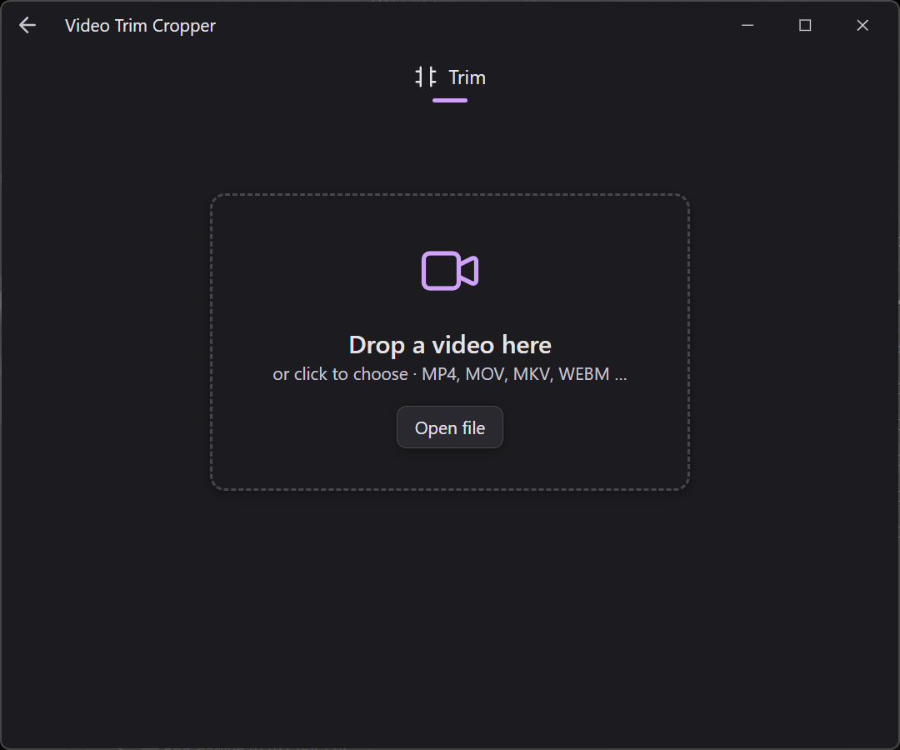
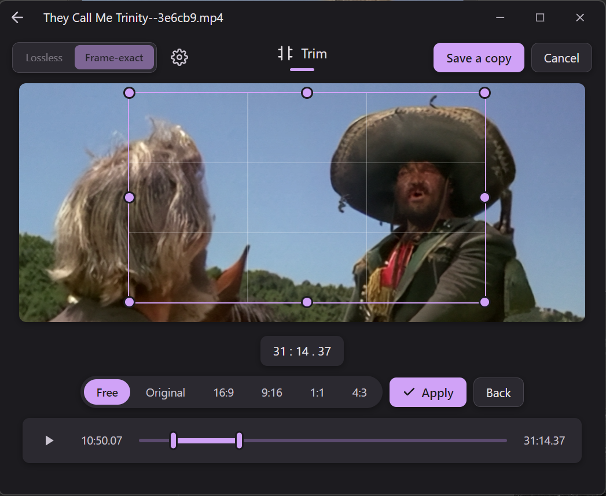
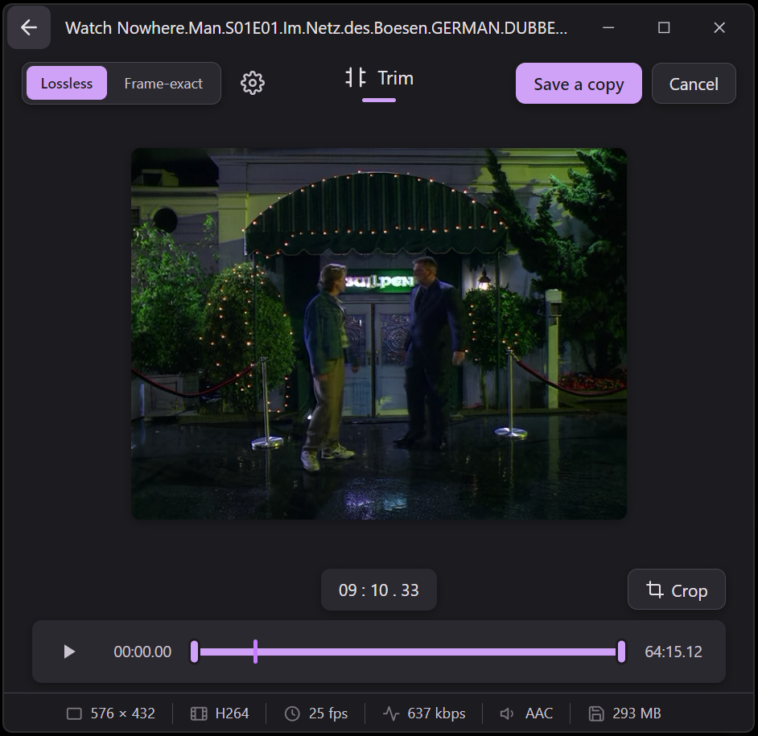

<div align="center">


# Easy to use, Modern, HW‑Accelerated Video Trimmer &amp; Cropper

Trim **and** crop any video in a single pass — losslessly where possible, hardware‑accelerated where not.
A clean, modern desktop app for Windows, inspired by the Windows Photos trim experience and powered by **ffmpeg**.


</div>

---

## ✨ Features

- **Trim + crop in one pass** — set your in/out points and crop region, export once.
- **Lossless trimming** — pure stream copy (`-c copy`): instant, zero quality loss.
- **Frame‑exact mode** — precise cuts via re‑encoding when you need them.
- **Hardware‑accelerated encoding** — automatically uses **NVIDIA NVENC**, **AMD AMF** or **Intel Quick Sync**, with a safe software (x264) fallback.
- **Draw‑to‑crop** — simply drag a rectangle with your mouse to crop.
- **Interactive crop** — fine‑tune the region with handles, snap to aspect presets (Free · Original · 16:9 · 9:16 · 1:1 · 4:3), with a live cropped preview.
- **Modern UI** — dark, Windows 11‑style interface with a purple accent; the window auto‑fits your video.
- **Drag &amp; drop** — just drop a file in, or click to browse.
- **Multi‑language** — English &amp; German, switchable in settings.
- **Self‑contained** — ffmpeg/ffprobe are bundled; nothing else to install.

## 📸 Screenshots

<div align="center">



*Trim — drag the timeline handles to set start &amp; end*



*Crop — drag a rectangle over the video, pick a ratio, hit Apply*



*Just drop a video in to get started*

</div>

## ⬇️ Download &amp; Install

Grab the latest build from the **[Releases page](https://github.com/NeverBeLazyG/VideoTrimCropper/releases/latest)**:

| File | What it is |
| --- | --- |
| **`VideoTrimCropper-<version>-portable.exe`** | Portable — a single file, no installation. Just double‑click (great for a USB stick). |
| **`VideoTrimCropper-<version>-setup.exe`** | Installer — installs per‑user and creates Desktop &amp; Start‑menu shortcuts. |

> **Windows SmartScreen** may warn on first launch because the app isn't code‑signed.
> Click **More info → Run anyway**. This is normal for open‑source, self‑signed builds.

## 🚀 Usage

1. **Open a video** — drag it onto the window, or click **Open file**.
2. **Trim** — drag the two handles on the timeline to set the start and end.
3. **Crop** (optional) — click **Crop**, drag a rectangle over the video, adjust it, pick an aspect ratio, then **Apply**.
4. **Pick the mode:**
   - **Lossless** — fastest, no re‑encode (cuts snap to the nearest keyframe).
   - **Frame‑exact** — re‑encodes for a precise cut.
5. **Save a copy** — choose where to write the result. That's it.

## 🧠 How it works

| You do… | The app does… |
| --- | --- |
| Trim only · **Lossless** | Stream copy (`-c copy`) — instant, bit‑for‑bit identical, cut aligned to keyframes. |
| Trim only · **Frame‑exact** | Re‑encodes for an exact cut. |
| **Crop** (with or without trim) | Cropping changes the pixel dimensions, so it always re‑encodes. |

Whenever the app re‑encodes, it detects your GPU and uses **hardware‑accelerated H.264** (NVENC / AMF / QSV) at visually‑lossless quality, falling back to software x264 if no supported GPU is available. Audio is stream‑copied so it stays lossless.

## 🛠️ Build from source

Requires [Node.js](https://nodejs.org/) (which includes npm) on Windows.

```bash
git clone https://github.com/NeverBeLazyG/VideoTrimCropper.git
cd VideoTrimCropper
npm install

npm start        # run the app in development
npm run dist     # build the portable .exe + installer into dist/
```

### Project layout

```
src/
  main/       Electron main process — window, IPC, ffmpeg (probe, HW detect, export)
  renderer/   UI — HTML/CSS/JS, timeline, crop tool, i18n
DESIGN.md     Design tokens (single source of truth for styles.css)
```

## 🧰 Tech stack

[Electron](https://www.electronjs.org/) · [ffmpeg](https://ffmpeg.org/) (via `ffmpeg-static` / `ffprobe-static`) · [electron‑builder](https://www.electron.build/)

## 📄 License

Released under the **Apache‑2.0** License. See [LICENSE](LICENSE).
